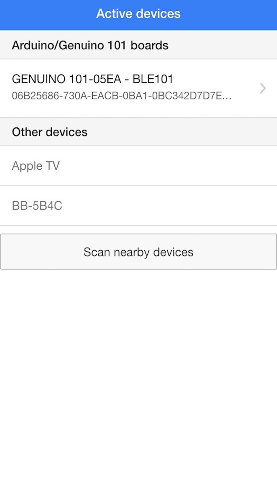
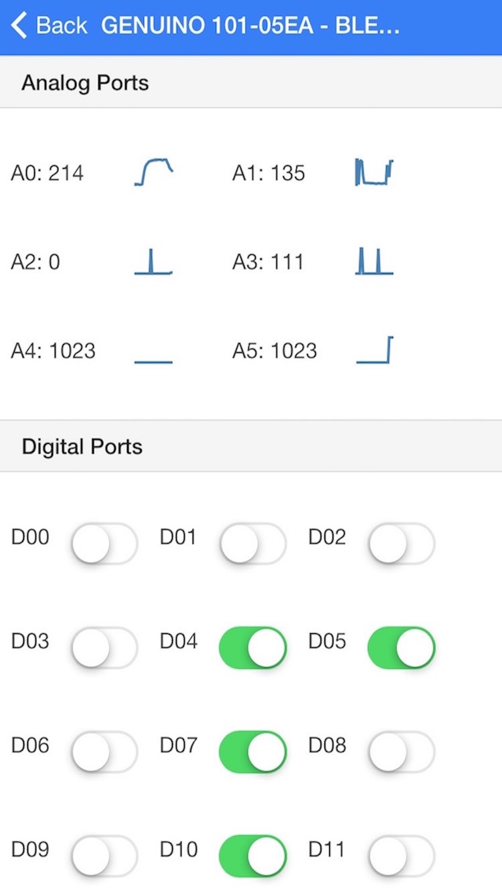

# BLE101
This is a Skecth for Arduino 101 (in USA) / Genuino 101 (out of USA) that allows communication through Bluetooth Low Energy (BLE) to monitor the values of analog pins and modify values of digital pins.

It can be used with the example mobile App BLE 101

Available for free on Andoid and iPhone

## Installing the skecth
Arduino 101 looks very similar to arduino UNO, but it is a different boatrd and you can't install the sketches exactly as you would do with UNO.

1) You need Arduino IDE 1.6.7 (or later) - Downloadable from https://www.arduino.cc/en/Main/Software
2) If you have it already installed, you must use the board 

So, where do we start? First, plug your Arduino 101 board to your computer with a simple USB cable, then download Arduino IDE 1.6.7 https://www.arduino.cc/en/Main/Software and install the required board package with the board manager:

So, where do we start? First, plug your Arduino 101 board to your computer with a simple USB cable, then download Arduino IDE 1.6.7 https://www.arduino.cc/en/Main/Software and install the required board package with the board manager:
